 # workshop.rcss.ir

## 📖 Introduction

The workshop.rcss.ir project is a SvelteKit application, automatically deployed using GitHub Actions and served globally through Cloudflare Workers.

---

## 🛠 Development Setup

For local development, please follow the steps below:

1. Clone the repository:

```bash
git clone https://github.com/<username>/workshop.rcss.ir.git
cd workshop.rcss.ir
```

2. Install dependencies:

```bash
npm install
```

3. Copy the `.env.example` file to a `.env` file and fill in the `TELEGRAM_BOT_ID` and `TELEGRAM_CHANNEL_ID`:

```bash
cp .env.example .env
# Edit the .env file with your Telegram credentials
```

4. Run the project locally:

```bash
npm run dev
```

## 🏗 Architecture

### Deployment Diagram

```mermaid
sequenceDiagram
    participant Developer as 💻 Developer
    participant GitHub as 📤 GitHub Actions
    participant Cloudflare as ⛅ Cloudflare Workers
    Developer->>GitHub: 1. Push code to repository
    GitHub->>Cloudflare: 2. Run CI/CD Pipeline
    Cloudflare->>Cloudflare: 3. Deploy new version
    Note right of Cloudflare: The application is now<br> live and distributed globally.
```



### Register Diagram


## 📜 License

This project is open-sourced under the MIT License. Feel free to use, modify, and distribute the code as you see fit.

## 🤝 Contributing

We warmly welcome contributions! 🙌

If you're interested in contributing to the workshop.rcss.ir project, feel free to open a pull request or raise an issue. For any questions, please reach out to our contact person:

📧 Email: [sadraiiali@gmail.com](mailto:sadraiiali@gmail.com)

👥 This project is part of the efforts by Iranopen committee members to provide a learning workshop on 2D soccer simulation.
